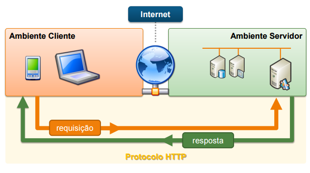

## Verbos e Status HTTP

> O que são verbos?

- 🎯 Comandos que dizem qual a ação que será tomada na URL;
- 🎯 Pode ser executado mais de um verbo por vez;

> Principais verbos utilizados para interagir com uma URL

- GET ☞ Utilizado para solicitar dados;
- POST ☞ Usado para cadastrar dados;
- PUT/PATCH ☞ É utilizado para atualizar algum dado;
- DELETE ☞ Usa-se para deletar algum dado.

**Um verbo utilizado em conjunto com uma URL gera uma solicitação**

> Oque são os atatus?

Os status indicam que um requisição foi processada. Importante ressaltar que **sempre haverá um status**
pois sempre há uma resposta a uma solicitação/requisição.

Os status funcionam por códigos que tem composições númericas. Cada centena indica um tipo de resposta

- 100 ☞ Mensagem de cunho informativo ao cliente.
- 200 ☞ Mensagem de êxito para a solicitação, geralmente a um GET.
- 300 ☞ Mensagem de redirecionamento.
- 400 ☞ Erro por parte do cliente/usuário. Sendo o mais famoso o erro 404.
- 500 ☞ Erro por parte do servidor.

